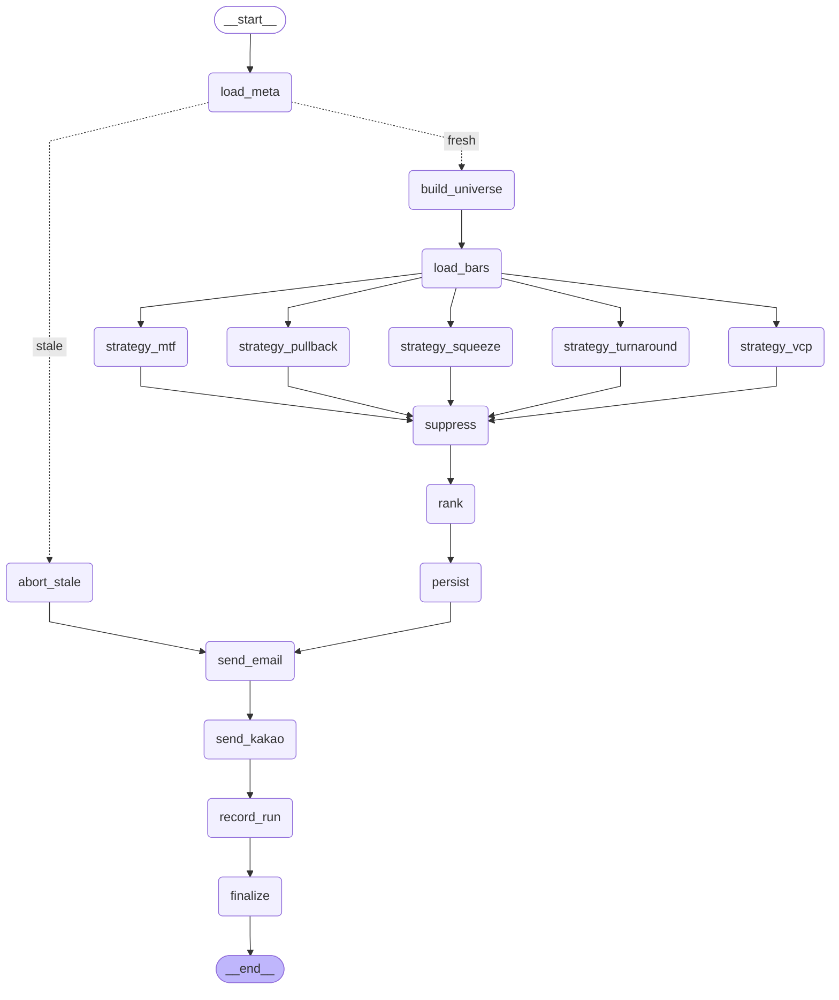

# GRAPH.md — 그래프 구조

> **이 파일은 `scripts/export_graph.py`가 생성한다. 직접 고치지 않는다.**
> 그래프를 바꿨으면 스크립트를 다시 돌려 커밋한다 (SPEC N12).
>
> 설계 의도와 각 노드가 하는 일은 `PLAN.md` §1-1을 본다.

```mermaid
---
config:
  flowchart:
    curve: linear
---
graph TD;
	__start__([<p>__start__</p>]):::first
	load_meta(load_meta)
	abort_stale(abort_stale)
	build_universe(build_universe)
	load_bars(load_bars)
	strategy_mtf(strategy_mtf)
	strategy_pullback(strategy_pullback)
	strategy_vcp(strategy_vcp)
	strategy_squeeze(strategy_squeeze)
	strategy_turnaround(strategy_turnaround)
	suppress(suppress)
	rank(rank)
	persist(persist)
	send_kakao(send_kakao)
	send_email(send_email)
	record_run(record_run)
	finalize(finalize)
	__end__([<p>__end__</p>]):::last
	__start__ --> load_meta;
	abort_stale --> send_email;
	build_universe --> load_bars;
	load_bars --> strategy_mtf;
	load_bars --> strategy_pullback;
	load_bars --> strategy_squeeze;
	load_bars --> strategy_turnaround;
	load_bars --> strategy_vcp;
	load_meta -. &nbsp;stale&nbsp; .-> abort_stale;
	load_meta -. &nbsp;fresh&nbsp; .-> build_universe;
	persist --> send_email;
	rank --> persist;
	record_run --> finalize;
	send_email --> send_kakao;
	send_kakao --> record_run;
	strategy_mtf --> suppress;
	strategy_pullback --> suppress;
	strategy_squeeze --> suppress;
	strategy_turnaround --> suppress;
	strategy_vcp --> suppress;
	suppress --> rank;
	finalize --> __end__;
	classDef default fill:#f2f0ff,line-height:1.2
	classDef first fill-opacity:0
	classDef last fill:#bfb6fc
```
